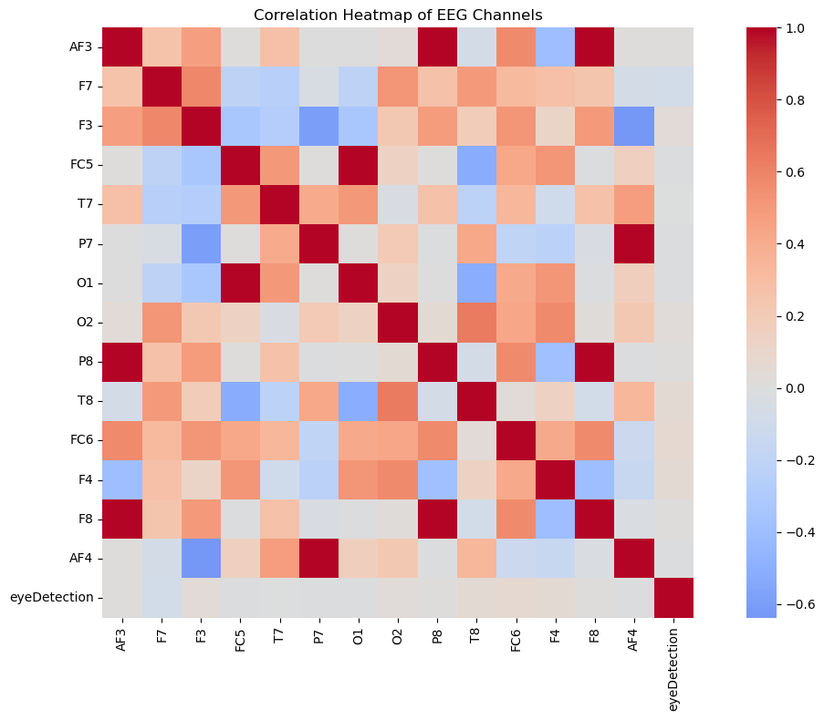
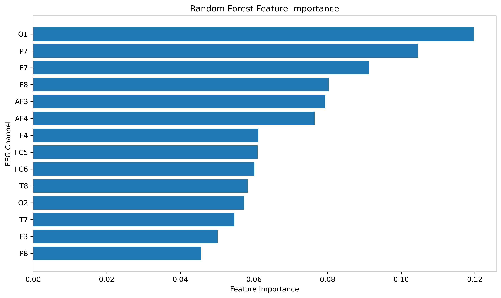

### EEG Eye State Classification using Machine Learning

#### Project Overview

This project presents an end-to-end machine learning solution for classifying whether a person's eyes are open or closed using Electroencephalography (EEG) signals. The project demonstrates the complete data science workflow, including data preprocessing, exploratory data analysis, feature engineering, model development, hyperparameter tuning, model evaluation, and interpretation.

The primary objective is to build a reliable machine learning model capable of accurately predicting eye states from EEG recordings while demonstrating best practices in data science and biomedical signal analysis.

---

#### Dataset

* **Dataset:** EEG Eye State Dataset
* **Source:** UCI Machine Learning Repository
* **Number of Samples:** 14,980
* **Number of EEG Channels (Features):** 14
* **Target Variable:** `eyeDetection`

  * **0** = Eyes Open
  * **1** = Eyes Closed

---

#### Project Objectives

* Understand EEG signal characteristics.
* Perform comprehensive exploratory data analysis (EDA).
* Build baseline and advanced machine learning models.
* Compare multiple classification algorithms.
* Optimize model performance using GridSearchCV.
* Interpret model predictions using Feature Importance.
* Demonstrate practical applications in biomedical signal analysis.

---

#### Technologies Used

* Python
* NumPy
* Pandas
* Matplotlib
* Seaborn
* SciPy
* Scikit-learn
* Jupyter Notebook

---

#### Machine Learning Workflow

1. Data Loading
2. Data Cleaning
3. Exploratory Data Analysis (EDA)
4. Statistical Analysis
5. Correlation Analysis
6. Distribution Analysis
7. Outlier Analysis
8. Logistic Regression (Baseline Model)
9. Random Forest Classifier
10. Hyperparameter Tuning (GridSearchCV)
11. Model Evaluation
12. ROC Curve Analysis
13. Feature Importance Analysis
14. Medical & Business Implications
15. Project Conclusion

---

#### Models Implemented

* Logistic Regression
* Random Forest Classifier
* Optimized Random Forest (GridSearchCV)

---

#### Model Performance

| Model               |   Accuracy |   ROC-AUC |
| ------------------- | ---------: | --------: |
| Logistic Regression |     58.51% |     0.606 |
| Random Forest       |     93.09% |     0.981 |
| Tuned Random Forest | **93.36%** | **0.982** |

The optimized Random Forest classifier produced the best overall performance and demonstrated excellent predictive capability for EEG eye state classification.

---

#### Project Structure

```text
eeg-eye-state-classification/
│
├── data/
│   └── EEG_Eye_State.arff
│
├── notebook/
│   └── EEG_Eye_State_Classification.ipynb
│
├── images/
│   ├── correlation_heatmap.png
│   ├── histogram.png
│   ├── boxplot.png
│   ├── confusion_matrix_logistic_regression.png
│   ├── confusion_matrix_random_forest.png
│   ├── roc_curve.png
│   └── feature_importance.png
│
├── README.md
├── requirements.txt
└── .gitignore
```

---

#### Key Visualizations

The project includes several visualizations to better understand the EEG data and model performance.

* Correlation Heatmap
* Feature Distribution Histograms
* Boxplots for Outlier Detection
* Logistic Regression Confusion Matrix
* Random Forest Confusion Matrix
* ROC Curve Comparison
* Feature Importance Plot

---

#### Correlation Heatmap



---

#### Feature Distribution


---

#### Outlier Detection


---

#### Logistic Regression Confusion Matrix


---

#### Random Forest Confusion Matrix


---

#### ROC Curve Comparison


---

#### Feature Importance



#### How to Run the Project

1. Clone the repository.

```bash
git clone https://github.com/pratapds/eeg-eye-state-classification.git
```

2. Navigate to the project directory.

```bash
cd eeg-eye-state-classification
```

3. Install the required Python packages.

```bash
pip install -r requirements.txt
```

4. Launch Jupyter Notebook.

```bash
jupyter notebook
```

5. Open:

```
notebook/EEG_Eye_State_Classification.ipynb
```

Run all cells to reproduce the complete analysis and results.

---

#### Real-World Applications

This project demonstrates how EEG-based machine learning can be applied in various real-world domains, including:

* Brain-Computer Interface (BCI) Systems
* Driver Drowsiness Detection
* Patient Monitoring
* Assistive Technologies
* Neurofeedback Systems
* Biomedical Signal Analysis
* Intelligent Healthcare Applications

---

#### Future Improvements

Possible future enhancements include:

* Evaluate advanced machine learning algorithms such as XGBoost and LightGBM.
* Explore deep learning models including CNNs and LSTMs for EEG classification.
* Apply advanced EEG preprocessing and feature extraction techniques.
* Improve model explainability using SHAP or LIME.
* Validate the model on additional EEG datasets collected from different participants and devices.
* Develop a real-time EEG eye state classification application.

---

#### Author

**Pratap N**

Aspiring Data Scientist | Machine Learning Enthusiast | Biomedical AI Learner

This project is part of my Data Science Portfolio, showcasing practical applications of machine learning in EEG signal analysis and healthcare.
